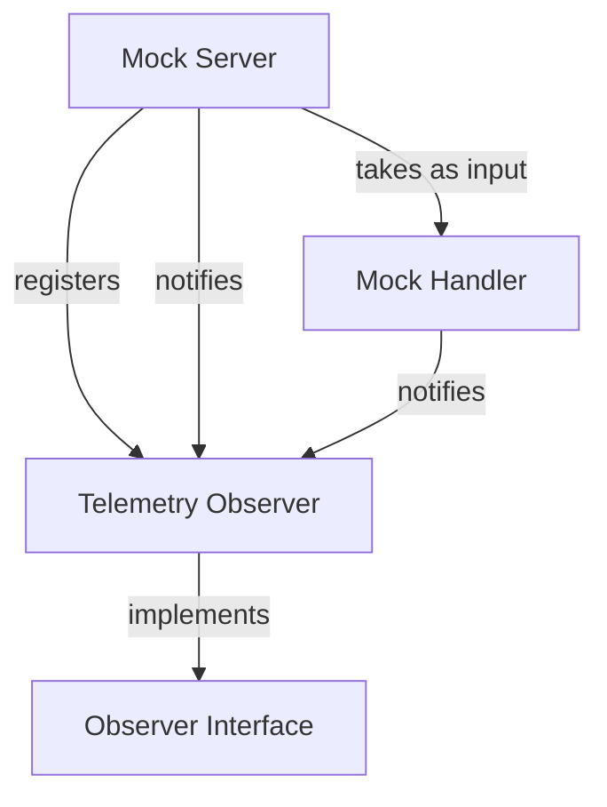

# Mock Server with Optional OpenTelemetry Instrumentation

This is a loosely coupled approach to adding OpenTelemetry instrumentation to an existing application using the Observer Pattern.

## Design Goals

- Minimal coupling: Core mock server functionality is unaware of telemetry
- Optional dependency: Telemetry can be completely removed without affecting core functionality
- Easy isolation: Can easily extract core functionality without any observability dependencies
- Low-level control: Manual span creation and attribute setting (no auto-instrumentation)

## Usage

`uv run --with-requirements requirements.txt mock_server.py --mock-data="../data/otel_sample.json" --debug`

`uv run --with-requirements requirements.txt mock_server.py --mock-data="../data/otel_sample.json" --enable-telemetry`

`uv run --with-requirements requirements.txt mock_server.py --mock-data="../data/otel_sample.json" --enable-telemetry --otlp-endpoint=http://localhost:4317`

## Architecture

### Observer Pattern Implementation

## Events Emitted

The mock server emits these events that telemetry can observe:

### Server Lifecycle
- `server.starting` - Server initialization begins
- `server.started` - Server is listening for requests  
- `server.shutting_down` - Shutdown initiated
- `server.stopped` - Server fully stopped

### Route Management
- `route.registered` - Route added to server configuration

### Request Handling
- `request.started` - HTTP request received
- `request.handled` - Request successfully processed
- `request.not_found` - Request to unknown endpoint

## Low-Level OpenTelemetry Features

This implementation demonstrates manual creation of:

### Attributes
- HTTP method, URL, status code
- Request headers (prefixed with `http.request.header.`)
- Server port, route configurations
- Response delay times

### Events
- Server state changes (listening, shutdown)
- Route registration details
- Request processing milestones

### Status Codes
- `OK` for successful operations (2xx responses)
- `ERROR` for failures (4xx/5xx responses, server errors)